# Database Configuration

Here is the guide to configure the database of the project.
This will be divided into few parts, to make it easier to understand.
> [!NOTE]
> The language used in the database is MySQL, with the ORM [Prisma](https://www.prisma.io/).

## Table of Contents

1. [Presentation](#presentation)
2. [How to initialize the database](#init)
3. [How to add a new server](#server)
4. [How to add a new service](#service)
5. [How to add actors](#actor)
6. [How to add a new action and create scenarios](#action)
7. [How to watch for the state of a service](#statevalue)

<br><a name="presentation"></a>
## 1. Presentation

The database is composed of few tables _(**21** in total)._
Here's the whole schema of the database:
<br>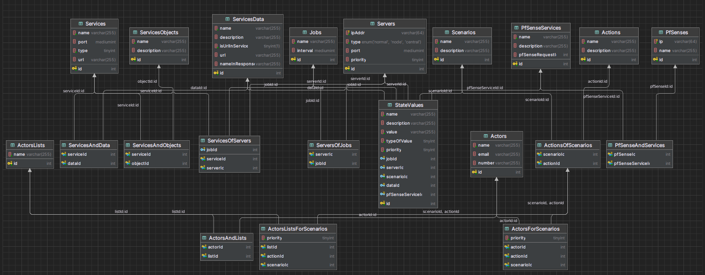
We will now go through the main parts of the database.
But first, we need to set up the database

<br><a name="init"></a>
## 2. How to initialize the database

We make use of the ORM [Prisma](https://www.prisma.io/) to manage the database.
No need to worry about its installation, it is already installed in the project. 
Just need to run `npm i` command to install the dependencies.

We now need to create the database (Do not forget to add your database url with credentials in it in the .env file)
To do so, first run thIS command in order to generate the prisma client file:
```bash
npx prisma generate
```

Then, we need to run the following command:
```bash
npx prisma migrate dev --name init
```
This will create the database and the tables.
> [!NOTE]
> This will create all the tables within **schema.prisma** file,
which is in the **prisma** folder. If there is any change in this file, you need to run the command again.

Now, your database is ready to be used.

<br><a name="server"></a>
## 3. How to add a new server

In this version of the watchdog, you <u>can't watch</u> for basic[¹] servers (**except** node servers which will adding them by themselves 
when starting their program, and this applies to this server too).
<br><u>But</u>, you can add pfSense servers, which will be used to watch for the state of its services.
<br>To do that, you need to add a new entry to the `PfSenses` Table :
<br>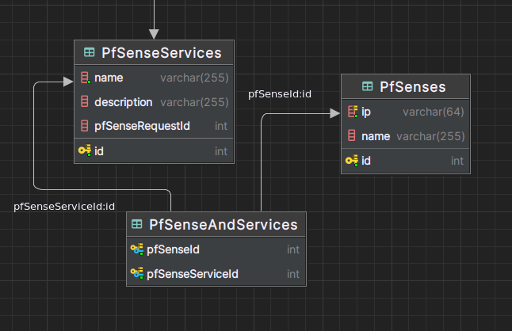
<br>Here is the description of the fields:
- **id**: The id of the server. It is automatically generated by the database.
- **name**: The name of the server. It is used to identify the server (could be the name of the company location).
- **ip**: The ip of the server. It is used to connect to the server.

<br>No need to add one by one the services of the pfSense, they will be added automatically at the initialization of the program
(If the PfSense server exists in database).

<u>Here's an example of a pfSense server :</u>

| id  | name | ip |
| --- | --- | --- |
| 1 | Site_Toulon | 192.168.187.125 |

[¹]: Basic servers stands for servers that are not pfSense servers.

<br><a name="service"></a>
## 4. How to add a new service

> [!NOTE]
> In this case, please note that we'll focus on services of type 1, which are the "services" that group together few data
elements to grab through api request for example.

To add services that the main server will watch, you first need to create the service category in `services` table :
<br>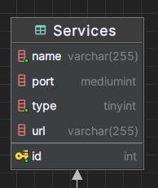
<br>Here is the description of the fields:
- **id**: The id of the service. It is automatically generated by the database.
- **name**: The name of the service. It is used to identify the service.
- **port**: The port of the service. It is used to identify the service, but not used in the program.
- **type**: The type of the service. It is used to identify the service : 0 for a service that is not a group of data, 
connected to a server, 1 for a service that is a group of data.
- **url**: The url to grab data from for services of type 1. If data object that we'll see later has not any url filled,
the program will use the link filled in the service to grab its value or information.

<u>Example:</u>

| id  | name | port | type | url |
| --- | --- | --- | --- | --- |
| 1 | Tickets | null | 1 | http://askformydata.com/api/1.0/data?id=1 |

<br>Then, you need to add the data object that will be grabbed from the service :
<br>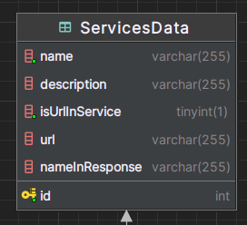
<br>Here is the description of the fields:
- **id**: The id of the data object. It is automatically generated by the database.
- **name**: The name of the data object *(Not used to identify object in request response)*.
- **description**: The description of the data object.
- **isUrlInService**: A boolean that indicates if the url of the service is used to grab the data object.
- **url**: The url to grab the data object from *(Used only if isUrlInService is false)*.
- **nameInResponse**: The name of the data object in the response *(Used to identify the data object in the response)*.

<u>Example:</u>

| id  | name | description | isUrlInService | url | nameInResponse |
| --- | --- | --- | --- | --- | --- |
| 1 | openTickets | Open tickets | true | null | openTickets |

<br>Finally, to link the 2 of them, you need to add an entry in the `ServicesAndData` table :
<br>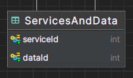
<br>Here is the description of the fields:
- **serviceId**: The id of the service.
- **dataId**: The id of the data object.

<u>Example:</u>

| serviceId  | dataId |
| --- | --- |
| 1 | 1 |

<br><a name="actor"></a>
## 5. How to add actors

Actors are the people that may be notified when there is a problem on a service.
<br>To add an actor, you need to add an entry in the `Actors` table :
<br>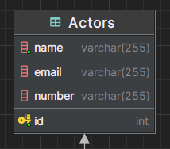
<br>Here is the description of the fields:
- **id**: The id of the actor. It can automatically be generated by the database. But to make it easier to identify the actor
  (and being compatible with some api urls), it is better to set it manually to the id of the employee.
- **name**: The name of the actor.
- **email**: The email of the actor (which can be null).
- **number**: The phone number of the actor (which can be null).

<u>Example:</u>

| id  | name | email | number |
| --- | --- | --- | --- | 
| 1 | John Doe | johndoe@gmail.com | 0123456789 |

<br>

> [!NOTE]
> You can create list of actors, to make it easier to notify a group of people.

<br>To do that, you need to add an entry in the `ActorsList` table :
<br>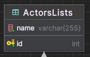
<br>Where you just need to fill the **name** field, which is the name of the list of actors.

<u>Example:</u>

| id  | name |
| --- | --- |
| 1 | Main List |

<br>Then, you need to link the actors to the list of actors, by adding an entry in the `ActorsAndLists` table :
<br>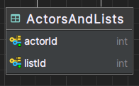

<u>Example:</u>

| actorId  | listId |
| --- | --- |
| 1 | 1 |

<br><a name="action"></a>
## 6. How to add a new action and create scenarios

The actions are the actions that will be triggered depending on the configured scenario and state value.
These actions are the ones in the **actions** folder. To use them, you have to add them in the database.
<br>To do that, you need to add entries in the **`Actions`** table :
<br>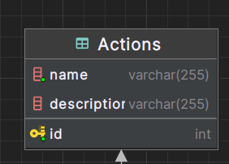
<br>Here is the description of the fields:
- **id**: The id of the action. It is automatically generated by the database.
- **name**: The name of the action. It is used to identify the action *(Note that they have to be the same as the actions'
names in files, not case-sensitive)*.
- **description**: The description of the action.

<u>Example:</u>

| id  | name | description |
| --- | --- | --- |
| 1 | sendEmail | Send an email to the actor. |

<br>Now, we can program scenarios. Scenarios are the way to set up one or more actions to be triggered when a service
has a problem. To do that, you need to add an entry in the `Scenarios` table :
<br>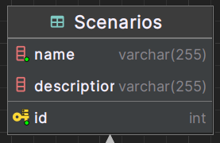

<u>Example:</u>

| id  | name | description |
| --- | --- | --- |
| 1 | tooMuchData | Alert when data overload |

<br>Then, you need to link the scenario with the actions you want to set up :
<br>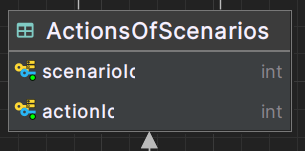

<u>Example:</u>

| scenarioId  | actionId |
| --- | --- |
| 1 | 1 |

<br>Finally, you need to link the scenario and action with the actor or list of actors you want to notify
(Depending on actors or lists, there will be 2 different tables) :
<br>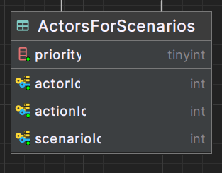
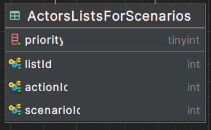

<u>Example:</u>

| scenarioId  | actorId | priority | actionId |
| --- | --- | --- | --- |
| 1 | 1 | 1 | 1 |

<br>As you can see, you can specify a priority for each actor or list of actors, depending on the action and the scenario.
The less the priority is, the more important the actor or list of actors is. 
> [!NOTE]
> Having actors and list of actors doesn't matter,
the program will take all of them, sort them by priority, and notify the most important ones if they aren't already been notified
or in vacations.

<br><a name="statevalue"></a>
## 7. How to watch for the state of a service

To watch for the state of a service, you need to add an entry in the `StateValues` table :
<br>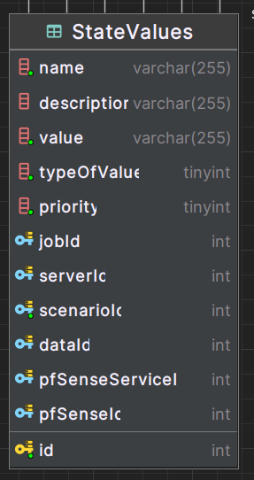
<br>Here is the description of the fields:
- **id**: The id of the state value. It is automatically generated by the database.
- **name**: The name of the state value you want to attribute.
- **description**: The description of the state value. Note that it will be used to create the message content for apiCash message.
- **value**: The value of the state value. It is used to identify the state value. You can specify a string or a number.
- **typeOfValue**: The type of the value. It is used to identify the type of the value : 0 for a string, 1 for a superior number
and 2 for an inferior number.
- **priority**: The priority of the state value. It is used to identify the priority of the state value among the others.
- **jobId**: The id of the job which is related to this state value.
- **serverId**: The id of the server which is related to this state value.
- **scenarioId**: The id of the scenario to trigger if the state value is triggered.
- **dataId**: The service data id which is related to this state value.
- **pfSenseServiceId**: The id of the pfSense service which is related to this state value.
- **pfSenseId**: The id of the pfSense which is related to this state value.

<u>Example:</u>

| id  | name | description | value | typeOfValue | priority | jobId | serverId | scenarioId | dataId | pfSenseServiceId | pfSenseId |
| --- | --- | --- | --- | --- | --- | --- | --- | --- | --- | --- | --- |
| 1 | tooMuchData | Alert when data overload | 100 | 1 | 1 | null | null | 1 | 1 | null | null |

In this example, the state value will be triggered if the data is superior to 100, data which depends on a type 1 service.

> [!NOTE]
> You can specify a job, a server, a service data, a pfSense service or a pfSense to the state value.
This needs to be only one of them.

Another point is that "jobId" wasn't presented yet in this documentation because it is not related to this program.